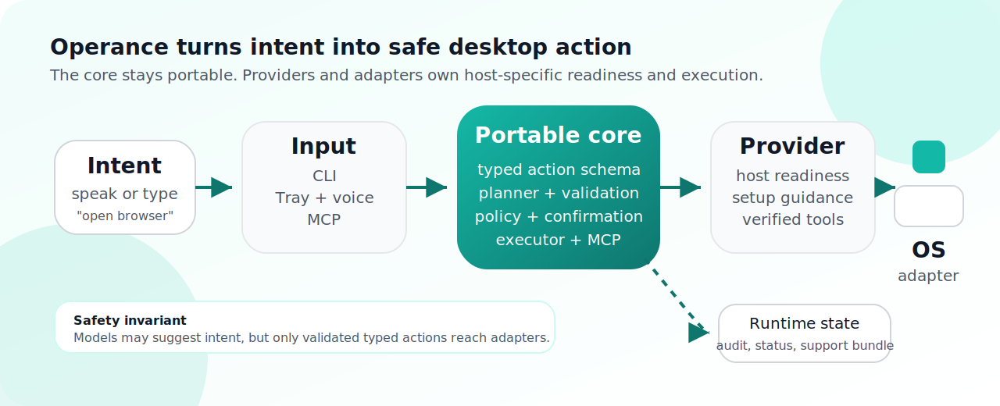
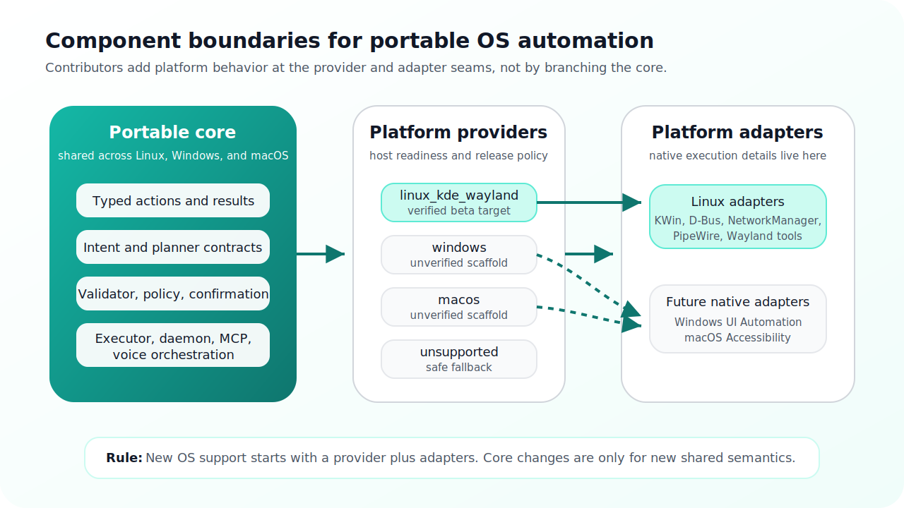

<h1>
  
  Operance
</h1>

Turn intent into action.

**Operance is a local-first AI desktop action layer that lets you control your
computer with natural language.** Speak or type what you want, and Operance
turns that intent into safe, typed desktop actions before anything runs.

The current public beta is Fedora KDE Plasma Wayland first and uses a tray-first
click-to-talk workflow. It is ready for outside developers and early adopters to
install, test, report issues, and help extend.

Today, Operance can open apps and websites, focus or quit apps with confirmation,
list recent files, list or search known folders by file name, show basic file
metadata, manage Desktop files or folders with confirmation, list, find, or
switch windows, answer desktop-status questions, and control basic audio state.
It also supports safe JSON desktop skill packs for adding exact phrase shortcuts
that emit existing typed actions without changing the portable core.

The tray and verified commands work without an AI model. A local
OpenAI-compatible model, such as an Ollama-served Qwen model, can be enabled as
a bounded planner fallback after `operance --planner-readiness` reports it is
safe to enable. Model output is still constrained to Operance's typed action
schema and goes through validation, policy, and confirmation gates.

For developers, Operance is also built to be extended. Under the hood, it has a
shared portable core, per-platform providers and adapters, and an MCP-compatible
control surface. The current delivery scope stays Linux-first while keeping the
core portable for later Windows and macOS adapters.



Platform roadmap:

- Phase 1: Linux/KDE/Wayland
- Phase 2: Windows
- Phase 3: macOS

The implementation stays Linux-first today. The portable core remains shared across platforms, including the voice pipeline orchestration, planner, typed action schema, safety model, and MCP server, while platform providers own host-specific readiness, setup workflow, and release-verification rules and OS-specific execution or input translation stays behind per-platform adapters. That keeps the current delivery scope simple without closing off the later Windows and macOS paths.

Windows and macOS provider scaffolds exist for adapter authors, but they are intentionally unverified and block live desktop commands until native adapters are implemented.



## Public Beta Quickstart

Use the packaged Fedora RPM for the public beta experience. From the current
GitHub release, run the setup script against that release's asset URL:

```bash
curl -fsSLO https://github.com/raunakkathuria/operance/releases/download/<release-tag>/setup.sh
bash ./setup.sh --release-url https://github.com/raunakkathuria/operance/releases/download/<release-tag>
operance --version
operance --installed-smoke
operance --public-beta-checklist
operance --beta-feedback
```

If you already downloaded the RPM from the same release, the stable local
package setup path is:

```bash
bash ./setup.sh --package ./operance-0.1.0-1.noarch.rpm
operance --version
operance --installed-smoke
operance --public-beta-checklist
operance --beta-feedback
```

Then click the tray icon and say:

```text
open browser
open the browser
open google.com
go to google.com
search google for linux automation
search the web for linux automation
open firefox
open downloads
open folder downloads
list files in downloads
find file named notes.txt
search documents for invoice
show details for notes.txt
show recent downloads
what apps are open
is firefox open
switch to firefox window
what time is it
wifi status
what is the volume
set volume to 50 percent
```

If anything fails, collect a support bundle before changing the machine:

```bash
operance --support-bundle
```

The bundle includes `issue-report.md`, a redacted paste-ready GitHub issue
draft. If you only need the draft without creating an archive, run:

```bash
operance --issue-report
```

For one combined install, verify, try, and report checklist, run:

```bash
operance --public-beta-checklist
operance --beta-feedback
```

The tray menu exposes **Setup and status**, **Try commands**, **Beta feedback
guide**, **Supported commands**, **Report an issue**, optional always-on
listening controls, recent interaction details, and release update checks.
Detailed diagnostics such as planner readiness,
installed-smoke output, and raw support snapshots remain available from the CLI
and the setup/status flow instead of crowding the default tray menu.

The release artifact set includes `setup.sh` beside the RPM, checksums, and
manifest. The repo-local copy lives at `scripts/setup.sh`. `--release-url`
downloads the manifest, checksums, setup script, and RPM from the same release
asset base URL, verifies `SHA256SUMS`, then runs the same install, tray startup,
installed-smoke, command catalog, and support-bundle flow as `--package`.

Use [docs/release/public-beta.md](docs/release/public-beta.md) for the public
beta install, local AI planner, release artifact, and feedback path.

The repository also includes a static public landing page at
[site/index.html](site/index.html). It explains Operance for new users and links
back to GitHub-rendered canonical Markdown docs for developer details. The
site build entrypoint is `./scripts/build_site.sh`, which writes a self-contained
artifact to `dist/pages/` by copying the shared brand icon into the deployment
root. The Cloudflare Workers Static Assets deployment is configured in
`wrangler.toml`: use `./scripts/build_site.sh` as the build command and
`npx wrangler deploy` as the deploy command.

## Developer Quickstart

Use this path when developing Operance itself from a source checkout:

```bash
./scripts/install_linux_dev.sh --ui --voice
.venv/bin/python -m operance.cli --version
.venv/bin/python -m operance.cli --about
.venv/bin/python -m operance.cli --check-updates
.venv/bin/python -m operance.cli --doctor
.venv/bin/python -m operance.cli --getting-started
.venv/bin/python -m operance.cli --supported-commands --supported-commands-available-only
.venv/bin/python -m operance.cli --skills
./scripts/run_mvp.sh
./scripts/run_checkout_smoke.sh
```

Try a few live commands from the verified subset:

```bash
OPERANCE_DEVELOPER_MODE=0 .venv/bin/python -m operance.cli --transcript "what time is it"
OPERANCE_DEVELOPER_MODE=0 .venv/bin/python -m operance.cli --transcript "what is my battery level"
OPERANCE_DEVELOPER_MODE=0 .venv/bin/python -m operance.cli --transcript "wifi status"
OPERANCE_DEVELOPER_MODE=0 .venv/bin/python -m operance.cli --transcript "open firefox"
OPERANCE_DEVELOPER_MODE=0 .venv/bin/python -m operance.cli --transcript "open localhost:3000"
OPERANCE_DEVELOPER_MODE=0 .venv/bin/python -m operance.cli --transcript "show recent files"
OPERANCE_DEVELOPER_MODE=0 .venv/bin/python -m operance.cli --transcript "list windows"
OPERANCE_DEVELOPER_MODE=0 .venv/bin/python -m operance.cli --transcript "switch to window firefox"
OPERANCE_DEVELOPER_MODE=0 .venv/bin/python -m operance.cli --transcript "set volume to 50 percent"
```

If the MVP path fails or you need to file a bug, collect the current issue artifact with:

```bash
.venv/bin/python -m operance.cli --support-bundle
```

That archive includes a generated `issue-report.md` draft. For a quick paste-only
draft from a source checkout, use:

```bash
.venv/bin/python -m operance.cli --issue-report
```

For release-readiness work, use the repository gate that combines tests, branding
guard, source-checkout smoke, reset-aware Fedora package gate dry-run, and the
installed desktop smoke checklist. The gate also runs controlled live command
smoke against a temporary desktop fixture, so file-command verification does not
touch your real Desktop directory:

```bash
./scripts/run_release_readiness_gate.sh
```

Before tagging a packaged release candidate on Fedora KDE, run the packaged
evidence gate from the same checkout. It rebuilds the `mvp` RPM, verifies the
artifact, installs it with stale user-service reset, runs installed desktop
smoke, captures a support bundle from the installed command, and then prints the
manual tray click-to-talk checks that still require your active desktop session:

```bash
./scripts/run_package_evidence_gate.sh
```

Current assumptions for that path:

- Linux
- KDE Plasma on Wayland
- local source checkout
- optional voice and UI extras installed when you want the tray and click-to-talk path

## Current Public Position

Operance is ready for a **Fedora KDE Wayland public beta** for outside developers and early adopters. It is not yet a broad public desktop release.

- Recommended public beta path: Fedora RPM install of the `mvp` runtime profile through `setup.sh`
- Developer/source path: source checkout with `./scripts/install_linux_dev.sh --ui --voice`, `.venv/bin/python -m operance.cli --doctor`, `./scripts/run_mvp.sh`, and `./scripts/run_checkout_smoke.sh`
- Default interaction: tray plus click-to-talk
- Optional always-on listening: the tray can start or stop the voice-loop service when the voice runtime is configured
- The supported Fedora package path now vendors the tray UI and STT runtime dependencies needed for the MVP tray plus click-to-talk path
- First installed-package diagnostic: `operance --installed-smoke`
- Public beta install, verify, try, and report checklist: `operance --public-beta-checklist`
- 10-minute beta feedback loop: `operance --beta-feedback`
- First-run activation diagnostic: `operance --getting-started`
- Explicit release-channel check: `operance --check-updates`
- Product-facing local AI setup guide: `operance --local-ai-coach`
- Local AI planner status check: `operance --planner-status`
- Paste-ready feedback draft: `operance --issue-report`
- Stable packaged setup entrypoint: `./scripts/setup.sh --package ./operance-0.1.0-1.noarch.rpm`
- Release-asset setup entrypoint: `./setup.sh --release-url https://github.com/raunakkathuria/operance/releases/download/<release-tag>`
- Tray-first onboarding: setup/status, try commands, beta feedback guide,
  supported commands, issue reporting, recent interaction details, update
  checks, and optional always-on listening controls are available from the tray
  menu
- Public beta distribution guide: [docs/release/public-beta.md](docs/release/public-beta.md)
- Packaged release-candidate evidence gate: `./scripts/run_package_evidence_gate.sh`
- Wake-word and TTS assets remain optional and are not part of the packaged support contract; spoken response text is available even when TTS audio is not configured
- Windows and macOS are architecture targets only; their current providers are scaffolds, not supported runtimes

Always-on listening is wake-word gated. For the current beta, the most reliable pattern is two steps:

```text
Operance
<short pause>
open browser
```

The same pattern applies to other commands, such as `go to google.com`, `search the web for linux automation`, or `what time is it`. You can also try one continuous phrase such as `Operance open browser`; the voice loop now feeds the wake frame into command capture and trims short wake-word residue when the command starter is recognized. If you only say `Operance` and no command follows, the tray reports that the wake word was heard and returns to waiting. Click-to-talk remains the recommended beta path when you want the most responsive command capture.

Not yet claimed:

- broad distro or desktop-environment support
- Windows or macOS delivery
- wake-word-first as the default interaction model
- a zero-setup consumer install story
- a skills marketplace or searchable skill registry

Use [docs/release/public-beta.md](docs/release/public-beta.md) for the public beta distribution path, [docs/release/public-handoff.md](docs/release/public-handoff.md) for the current public handoff, [docs/release/release-readiness.md](docs/release/release-readiness.md) for the release stop line, [docs/release/fedora-checklist.md](docs/release/fedora-checklist.md) for the exact Fedora gate, [docs/release/release-plan.md](docs/release/release-plan.md) for the current release sequence, [docs/requirements/linux.md](docs/requirements/linux.md) for Linux setup, packaging, and advanced diagnostics, and [docs/release/public-repo-metadata.md](docs/release/public-repo-metadata.md) for suggested GitHub About metadata.

## How To Contribute

Anyone can contribute right now through one of these paths:

- test Operance on Fedora KDE Wayland and file reproducible issues with a support bundle
- improve onboarding, troubleshooting, and public handoff docs
- add safe JSON phrase shortcuts through desktop skill packs
- add tests and bug fixes that make tray plus click-to-talk more reliable
- harden packaging, setup, doctor, and release-gate workflows

This is still a founder-maintained public beta. Small, focused fixes and high-quality issue reports are more useful than broad rewrites.

Start with [CONTRIBUTING.md](CONTRIBUTING.md). For larger product or architecture changes, read [docs/specs/README.md](docs/specs/README.md) and the current [beta product direction](docs/specs/beta-product-direction.md) before coding. If you want to add a safe phrase shortcut for existing behavior, read [docs/contributing/skill-packs.md](docs/contributing/skill-packs.md). If you want to add a new desktop command, read [docs/contributing/command-authoring.md](docs/contributing/command-authoring.md) before changing core modules. If you are reporting a problem instead of sending a patch, attach the output artifact from `.venv/bin/python -m operance.cli --support-bundle` whenever possible and paste the bundled `issue-report.md` draft into the issue body.

This repository already contains the Phase 0A foundation plus the later planner, MCP, Linux-adapter, tray, voice, and release-tooling slices needed for the current public beta. Keep `README.md` for the public stop line and use [CHANGELOG.md](CHANGELOG.md) when you need the feature-by-feature implementation history.

## Current status

Operance already has a coherent Linux-first public beta path: a typed and validated runtime, tray plus click-to-talk MVP flow, and Fedora packaging or support tooling. For the current public handoff, the supported command surface is intentionally narrower than the full implemented runtime. Use [CHANGELOG.md](CHANGELOG.md) for the feature-by-feature implementation history.

What works now:

- Core runtime: typed action models, deterministic intent matching, validator and policy enforcement, local audit logging, bounded local planner fallback, and MCP-compatible control surfaces.
- Verified command subset on Fedora KDE Wayland: `open browser`, `open the browser`, `open google.com`, `go to <website>`, `search google for <query>`, `search the web for <query>`, `open <app name>` for installed desktop apps, safe two-step launch phrases such as `open firefox and load localhost:3000` or `open firefox and notify me`, `focus <app name>`, confirmation-gated `quit <app name>`, `open downloads`, `open folder downloads`, `open documents`, `open desktop`, `show recent files`, read-only known-folder discovery such as `list files in downloads`, `show files in documents`, `find file named <name>`, `find folder named <name>`, and `search documents for <name>`, read-only metadata commands such as `show details for <name>`, `how big is <name>`, `when was <name> modified`, and `show recent downloads`, `create folder on desktop called <name>`, confirmation-gated desktop file or folder delete, rename, and move commands, window awareness commands such as `list windows`, `what apps are open`, `is <app> open`, `find window <title>`, `switch to window <title>`, and `switch to <title> window`, `show a notification saying <message>`, `what time is it`, `time`, `what is my battery level`, `battery`, `wifi status`, `what is the volume`, `volume`, `is audio muted`, `muted`, `set volume to 50 percent`, `volume 50 percent`, `mute audio`, `mute`, `unmute audio`, and `unmute`.
- Tray feedback: when a command is heard, the tray state changes through `Understanding command` and `Opening <target>` or `Executing command`, and the tooltip shows `Heard: ...` before the final result notification.
- Command recovery: unclear commands now return concrete examples such as `open browser`, `open google.com`, `search google for linux automation`, and `what time is it`; known Firefox speech variants such as `fire fall` and `fire force` are conservatively mapped to `firefox` for launch, focus, and quit commands.
- Command coach: the tray exposes `Try commands`, and the CLI exposes `operance --command-coach`, with guided click-to-talk examples, expected outcomes, and recovery tips for first-run testing.
- Voice and tray MVP: tray app, bounded click-to-talk, tray-managed always-on voice-loop controls, confirmation flows, last-interaction reporting, optional wake-word, STT, spoken response text, and TTS probe paths, plus repo-local background voice-loop support.
- Diagnostics and support: version/about provenance, explicit release-channel checks, doctor, setup actions, installed readiness checks, runnable-command catalog, runtime status resources, support snapshot, support bundle, audit inspection, and source-checkout smoke scripts.
- Packaging and release gates: reproducible Linux bootstrap, source-checkout install or uninstall helpers, repo-local systemd helpers, Debian or RPM scaffolds, installed-package smoke, package evidence capture, and the Fedora gate.

What is intentionally not implemented yet:

This is still a narrow public beta. The main remaining gaps are broader platform coverage and deeper Linux coverage, not the absence of a basic runnable product path. Broader implemented commands remain out of the supported verified subset until they are live-verified and graduate into `--supported-commands --supported-commands-available-only`.

- Native package coverage beyond the current Fedora RPM `mvp` runtime path
- A bundled Operance wake-word model and tuned default wake-word behavior
- Richer STT and TTS beyond the current optional bounded paths
- Broader KDE execution coverage and live Windows or macOS adapters beyond the current unverified provider scaffolds
- Richer tray UI and planner recovery beyond the current bounded implementation

## Development and Diagnostics

README intentionally stays narrow for the public beta. Use these docs for the deeper reference material instead of treating the README as a command inventory:

- [docs/requirements/linux.md](docs/requirements/linux.md) for Linux setup, packaging, systemd, planner, and optional voice diagnostics
- [docs/specs/README.md](docs/specs/README.md) for the spec-to-PR workflow
- [docs/specs/beta-product-direction.md](docs/specs/beta-product-direction.md)
  for current product direction, beta contract, and milestone roadmap
- [docs/release/public-handoff.md](docs/release/public-handoff.md) for the outside-developer handoff
- [docs/release/public-beta.md](docs/release/public-beta.md) for public beta install, local AI planner, and feedback flow
- [docs/release/fedora-checklist.md](docs/release/fedora-checklist.md) for the Fedora release gate
- [CONTRIBUTING.md](CONTRIBUTING.md) for contributor workflow and verification expectations

## Open-source baseline

The local core in this repository is released under the [MIT License](LICENSE).
That open-source boundary covers the local daemon, typed action and safety
runtime, desktop adapters, local voice loop, MCP server, and repo-local setup
tooling. Optional hosted relay, sync, or managed inference layers remain outside
the current runnable scope of this repo.

The repo now also includes a baseline public-project trust surface:

- [CONTRIBUTING.md](CONTRIBUTING.md) for workflow and verification expectations
- [SECURITY.md](SECURITY.md) for vulnerability reporting expectations
- [CODE_OF_CONDUCT.md](CODE_OF_CONDUCT.md) for contributor behavior
- [docs/architecture/overview.md](docs/architecture/overview.md) for the
  portable-core versus platform-adapter boundary
- [docs/architecture/adapter-authoring.md](docs/architecture/adapter-authoring.md)
  for the current provider, adapter, and conformance contract
- [docs/specs/README.md](docs/specs/README.md) for the required spec-to-PR
  workflow before larger product or architecture changes
- [examples/adapter_sdk/README.md](examples/adapter_sdk/README.md) for
  executable minimal adapter and provider examples
- [docs/contributing/command-authoring.md](docs/contributing/command-authoring.md)
  for adding a typed command without leaking platform details into core
- [docs/release/fedora-checklist.md](docs/release/fedora-checklist.md)
  for the current Fedora KDE release gate and stop line
- [docs/release/public-beta.md](docs/release/public-beta.md) for the packaged
  public beta distribution and feedback path
- [docs/requirements/linux.md](docs/requirements/linux.md) for Linux machine
  setup and live integration status
- `.github/workflows/ci.yml`, which runs the full test suite, minimal CLI smoke
  checks, and packaging or release dry-run smoke checks on pushes and pull
  requests

## Development

Use this section as the detailed reference, not the first-run path. The normal loop for a new machine is: bootstrap, run `--doctor`, run `./scripts/run_mvp.sh`, and then use the lower-level commands below only when you are debugging a specific subsystem.

Bootstrap a reproducible local development environment:

```bash
./scripts/install_linux_dev.sh
./scripts/install_linux_dev.sh --ui --voice
```

Run the source-checkout local install orchestrator:

```bash
./scripts/install_local_linux_app.sh
./scripts/install_local_linux_app.sh --voice --dry-run
./scripts/install_local_linux_app.sh --voice-loop --dry-run
```

Roll back the source-checkout local install orchestrator:

```bash
./scripts/uninstall_local_linux_app.sh --dry-run
./scripts/uninstall_local_linux_app.sh --remove-venv --dry-run
./scripts/uninstall_local_linux_app.sh --voice-loop --dry-run
```

Inspect the projected setup-status snapshot:

```bash
python3 -m operance.cli --setup-snapshot
python3 -m operance.cli --setup-actions
python3 -m operance.cli --setup-app
python3 -m operance.cli --setup-run-action install_ui_backend --setup-dry-run
python3 -m operance.cli --setup-run-action install_voice_loop_service --setup-dry-run
python3 -m operance.cli --setup-run-action install_voice_loop_user_config --setup-dry-run
python3 -m operance.cli --setup-run-action inspect_voice_loop_config --setup-dry-run
python3 -m operance.cli --setup-run-action enable_voice_loop_service --setup-dry-run
python3 -m operance.cli --setup-run-action probe_planner_health --setup-dry-run
python3 -m operance.cli --setup-run-action build_rpm_package_artifact --setup-dry-run
python3 -m operance.cli --setup-run-recommended --setup-dry-run
python3 -m operance.cli --voice-loop-config
python3 -m operance.cli --voice-loop-service-status
python3 -m operance.cli --voice-loop-status
python3 -m operance.cli --voice-self-test --use-voice-loop-config
python3 -m operance.cli --wakeword-eval-frames 50 --use-voice-loop-config
```

The manual venv flow remains supported:

```bash
python3 -m venv .venv
source .venv/bin/activate
python3 -m pip install -e ".[dev]"
python3 -m pytest
```

Install the optional voice backends for the wake-word, STT, and TTS probe paths:

```bash
python3 -m pip install -e ".[dev,voice]"
```

Run the optional bounded TTS probe when you have local Kokoro model assets:

```bash
python3 -m operance.cli --tts-probe-text "Hello from Operance" --tts-model /path/to/kokoro.onnx --tts-voices /path/to/voices.bin --tts-output /tmp/operance-hello.wav
python3 -m operance.cli --tts-probe-text "Hello from Operance" --tts-model /path/to/kokoro.onnx --tts-voices /path/to/voices.bin --tts-output /tmp/operance-hello.wav --tts-play
```

If you keep those assets in one of the discovered default locations, the CLI and setup surface can now use them without repeating the flags:

```bash
export OPERANCE_TTS_MODEL=/path/to/kokoro.onnx
export OPERANCE_TTS_VOICES=/path/to/voices.bin
python3 -m operance.cli --tts-probe-text "Hello from Operance" --tts-output /tmp/operance-hello.wav --tts-play
```

For wake-word models, keep the external `operance.onnx` file in one of the discovered locations or point `OPERANCE_WAKEWORD_MODEL` at it, then opt into that discovered asset with `--wakeword-model auto`:

```bash
export OPERANCE_WAKEWORD_MODEL=/path/to/operance.onnx
python3 -m operance.cli --wakeword-probe-frames 3 --wakeword-model auto
python3 -m operance.cli --voice-session-frames 40 --wakeword-model auto
python3 -m operance.cli --voice-loop --wakeword-model auto
```

Run a bounded live voice session that also saves synthesized response audio:

```bash
python3 -m operance.cli --voice-session-frames 40 --wakeword-model /path/to/operance.onnx --voice-session-tts-output-dir /tmp/operance-spoken --tts-model /path/to/kokoro.onnx --tts-voices /path/to/voices.bin
python3 -m operance.cli --voice-session-frames 40 --wakeword-model /path/to/operance.onnx --voice-session-tts-output-dir /tmp/operance-spoken --voice-session-tts-play --tts-model /path/to/kokoro.onnx --tts-voices /path/to/voices.bin
```

Run the continuous live voice loop, optionally with finite stop criteria for local smoke tests:

```bash
python3 -m operance.cli --voice-loop --wakeword-model /path/to/operance.onnx
python3 -m operance.cli --voice-loop --voice-loop-max-commands 2 --wakeword-model /path/to/operance.onnx
./scripts/run_voice_loop.sh -- --wakeword-model /path/to/operance.onnx
./scripts/run_voice_loop.sh --args-file .operance/voice-loop.args
./scripts/run_voice_loop.sh -- --voice-loop-max-commands 2 --wakeword-model /path/to/operance.onnx
```

An optional repo-local `.operance/voice-loop.args` file is read first, then `~/.config/operance/voice-loop.args` is used as a fallback, with one CLI token per line and blank lines or `#` comments ignored. The repo-local `operance-voice-loop.service` unit now relies on that launcher search order instead of hardwiring one args file path in the unit itself.

Install the optional tray UI backend:

```bash
python3 -m pip install -e ".[dev,ui]"
```

Run the checked-in deterministic local demo:

```bash
./scripts/run_demo.sh
./scripts/run_demo.sh --dry-run
```

Install the repo-local tray user service scaffold:

```bash
./scripts/install_systemd_user_service.sh --dry-run
./scripts/install_systemd_user_service.sh --skip-systemctl
```

Remove the repo-local tray user service scaffold:

```bash
./scripts/uninstall_systemd_user_service.sh --dry-run
./scripts/uninstall_systemd_user_service.sh --skip-systemctl
```

Tail recent logs for the repo-local tray or voice-loop user service:

```bash
./scripts/tail_systemd_user_service_logs.sh --dry-run
./scripts/tail_systemd_user_service_logs.sh --lines 100 --follow
./scripts/tail_systemd_user_service_logs.sh --voice-loop --lines 100
```

Enable, disable, or otherwise control the repo-local tray or voice-loop user services:

```bash
./scripts/control_systemd_user_services.sh status --dry-run
./scripts/control_systemd_user_services.sh enable --voice-loop --dry-run
./scripts/control_systemd_user_services.sh restart --voice-loop --dry-run
./scripts/control_systemd_user_services.sh restart --all --dry-run
```

Install or remove the repo-local continuous voice-loop user service:

```bash
./scripts/install_voice_loop_user_service.sh --dry-run
./scripts/install_voice_loop_user_service.sh --skip-systemctl
./scripts/uninstall_voice_loop_user_service.sh --dry-run
./scripts/uninstall_voice_loop_user_service.sh --skip-systemctl
```

Render the shared packaged desktop and systemd assets:

```bash
./scripts/render_packaged_assets.sh --dry-run
./scripts/render_packaged_assets.sh --output-dir dist/packaged-assets
```

The packaged voice-loop scaffold now uses `/usr/lib/operance/voice-loop-launcher`, which prefers optional one-token-per-line args from `~/.config/operance/voice-loop.args` and falls back to `/etc/operance/voice-loop.args` before starting `operance --voice-loop`. The package scaffolds also ship `/etc/operance/voice-loop.args.example` as a starting point for that file.

Seed a user-scoped voice-loop config from the packaged or repo example file:

```bash
./scripts/install_voice_loop_user_config.sh --dry-run
./scripts/install_voice_loop_user_config.sh --force --dry-run
```

Update the user-scoped voice-loop config with a calibrated threshold or discovered wake-word model token:

```bash
./scripts/update_voice_loop_user_config.sh --wakeword-threshold 0.72 --dry-run
./scripts/update_voice_loop_user_config.sh --wakeword-model auto --dry-run
```

Stage external voice assets into the discovered user-scoped config paths:

```bash
python3 -m operance.cli --voice-asset-paths
./scripts/install_wakeword_model_asset.sh --source /path/to/operance.onnx --dry-run
./scripts/install_tts_assets.sh --model /path/to/kokoro.onnx --voices /path/to/voices.bin --dry-run
```

If you want the setup surface to run those install helpers directly, export source paths first:

```bash
export OPERANCE_WAKEWORD_MODEL_SOURCE=/path/to/operance.onnx
export OPERANCE_TTS_MODEL_SOURCE=/path/to/kokoro.onnx
export OPERANCE_TTS_VOICES_SOURCE=/path/to/voices.bin
python3 -m operance.cli --setup-actions
```

Render the Debian package staging tree:

```bash
./scripts/build_deb_package.sh --dry-run
./scripts/build_deb_package.sh --skip-build --staging-dir dist/deb/operance
```

Render the RPM package staging tree:

```bash
./scripts/build_rpm_package.sh --dry-run
./scripts/build_rpm_package.sh --skip-build --spec-dir dist/rpm
```

Render both package scaffolds in one pass:

```bash
./scripts/build_package_scaffolds.sh --dry-run
./scripts/build_package_scaffolds.sh --root-dir dist/packages
```

Build package artifacts through the existing helper scripts:

```bash
./scripts/build_package_artifacts.sh --dry-run
./scripts/build_package_artifacts.sh --rpm --root-dir dist/package-artifacts
```

Install the native package build tools used by those helpers:

```bash
./scripts/install_packaging_tools.sh --dry-run
./scripts/install_packaging_tools.sh --rpm --dry-run
```

The RPM helper now copies the built artifact back into `dist/package-artifacts/rpm/`, so the install helper can consume the documented path directly instead of reaching into the rpmbuild staging tree. That copy step now tolerates Fedora-style internal filenames like `operance-0.1.0-1.fc43.noarch.rpm` while still writing the documented normalized output path. The Fedora release gate helpers now also fail fast with `./scripts/install_packaging_tools.sh --rpm` when `rpmbuild` is missing, so packaging-host blockers are surfaced before the longer gate steps start.

The current Fedora `mvp` package installs `/usr/bin/operance`, the packaged Python source tree, and the tray UI plus STT Python runtime needed for the click-to-talk path under `/usr/lib/operance`. The packaged command defaults to live Linux adapters (`OPERANCE_DEVELOPER_MODE=0`), so `operance --transcript "open firefox"` and tray click-to-talk should affect the desktop instead of returning simulated success. Wake-word and TTS assets remain optional and outside the packaged support contract.

Install a built native package artifact:

```bash
./scripts/setup.sh --package dist/package-artifacts/rpm/operance-0.1.0-1.noarch.rpm --dry-run
./scripts/install_package_artifact.sh --package dist/package-artifacts/deb/operance_0.1.0_all.deb --installer apt --dry-run
./scripts/install_package_artifact.sh --package dist/package-artifacts/rpm/operance-0.1.0-1.noarch.rpm --installer dnf --dry-run
./scripts/install_package_artifact.sh --package dist/package-artifacts/rpm/operance-0.1.0-1.noarch.rpm --installer dnf --replace-existing --dry-run
./scripts/install_package_artifact.sh --package dist/package-artifacts/rpm/operance-0.1.0-1.noarch.rpm --installer dnf --replace-existing --reset-user-services --dry-run
```

Use `./scripts/setup.sh` for the outside-developer packaged setup path. It
composes package installation, stale user-service reset, tray startup,
installed readiness, supported-command discovery, support-bundle capture, and
the manual tray smoke checklist behind one stable lifecycle command. Keep this
script name stable across release phases.
Use `--replace-existing` when testing a rebuilt Fedora RPM with the same package version. The helper removes the installed package when present and then installs the provided artifact, otherwise it keeps the normal first-install path.
Use `--reset-user-services` when switching from a source-checkout tray service to the packaged tray service. It stops, disables, and removes only user-scoped Operance systemd units before installing, so stale `~/.config/systemd/user` units cannot shadow the packaged units.

Smoke-test an installed native package, optionally installing the artifact first:

```bash
./scripts/run_installed_package_smoke.sh --dry-run
./scripts/run_installed_package_smoke.sh --package dist/package-artifacts/rpm/operance-0.1.0-1.noarch.rpm --installer dnf --require-mvp-runtime --dry-run
./scripts/run_installed_package_smoke.sh --package dist/package-artifacts/rpm/operance-0.1.0-1.noarch.rpm --installer dnf --require-mvp-runtime --reset-user-services --dry-run
```

The installed package smoke runs the same package-local diagnostic users can run with `operance --installed-smoke`. When `--require-mvp-runtime` is enabled, it also checks that the active tray service is not shadowed by a stale source-checkout user unit.

Run the full Fedora-first release gate from a checkout:

```bash
./scripts/run_fedora_release_smoke.sh --dry-run
./scripts/run_fedora_release_smoke.sh --reset-user-services --dry-run
./scripts/run_fedora_release_smoke.sh --support-bundle-out /tmp/operance-release-support.tar.gz --dry-run
```

Run the full Fedora gate from a checkout:

```bash
./scripts/run_fedora_gate.sh --dry-run
./scripts/run_fedora_gate.sh --reset-user-services --dry-run
./scripts/run_fedora_gate.sh --support-bundle-out /tmp/operance-release-support.tar.gz --dry-run
```

Run the release-readiness gate from a checkout:

```bash
./scripts/run_release_readiness_gate.sh --dry-run
./scripts/run_release_readiness_gate.sh
./scripts/run_release_readiness_gate.sh --run-package-gate
```

The full package gate keeps the RPM installed so the installed desktop smoke and
manual tray click-to-talk checks can run against that package.

Run the packaged evidence gate before tagging a Fedora KDE package release
candidate:

```bash
./scripts/run_package_evidence_gate.sh --dry-run
./scripts/run_package_evidence_gate.sh --bundle-python .venv/bin/python
./scripts/run_package_evidence_gate.sh --support-bundle-out /tmp/operance-installed-support.tar.gz
./scripts/run_package_evidence_gate.sh --bundle-python .venv/bin/python --evidence-dir /tmp/operance-release-evidence
```

This gate rebuilds the `mvp` RPM, verifies the normalized RPM artifact, installs
it with `--replace-existing --reset-user-services`, runs installed desktop
smoke, captures installed JSON evidence for build identity, installed smoke,
public beta checklist, command coach, local AI coach, supported commands,
and `operance --support-bundle` from the installed command, and prints the
manual tray click-to-talk checks to run before tagging.

Run the installed desktop smoke after installing the RPM in an active Fedora KDE
Wayland session:

```bash
./scripts/run_installed_desktop_smoke.sh --dry-run
./scripts/run_installed_desktop_smoke.sh
```

The packaged tray is click-to-talk first, with optional always-on listening controls for the voice-loop service. In always-on mode, say `Operance`, pause briefly, then say the command. You can also try `Operance open browser` as one phrase; the wake-word-gated path now feeds the wake frame into STT and trims short leading wake-word residue before known command starters, so transcripts like `Operants, open browser` can still run as `open browser`. When the wake word is detected, the tray shows `I'm listening` so you know the next phrase is being captured; after a final transcript runs, the result notification replaces that listening acknowledgement. If no command follows, the tray reports `I heard Operance, but no command followed.` and returns to wake waiting. Tray notifications stay visible long enough to read, and click-to-talk remains the fastest manual path. A missing continuous voice-loop runtime status file is expected unless the background wake-word loop has been started separately, and it should not block click-to-talk result notifications. Spoken response text is recorded in the last-interaction report; audio playback still requires configured TTS assets.

When testing from a source checkout without rebuilding or reinstalling the RPM, run the source tray directly. In source-checkout mode, the tray starts and stops a repo-local `python -m operance.cli --voice-loop` child process with the same environment instead of controlling the packaged systemd voice-loop service, so click-to-talk and always-on status use the same data directory.

Remove an installed native package:

```bash
./scripts/uninstall_native_package.sh --installer apt --dry-run
./scripts/uninstall_native_package.sh --installer dnf --package-name operance --dry-run
```

Use real Linux desktop adapters instead of mocks:

```bash
OPERANCE_DEVELOPER_MODE=0 python3 -m operance.cli --doctor
OPERANCE_DEVELOPER_MODE=0 python3 -m operance.cli --transcript "what is my battery level"
OPERANCE_DEVELOPER_MODE=0 python3 -m operance.cli --transcript "open firefox"
OPERANCE_DEVELOPER_MODE=0 python3 -m operance.cli --transcript "open localhost:3000"
OPERANCE_DEVELOPER_MODE=0 python3 -m operance.cli --transcript "open firefox and load localhost:3000"
OPERANCE_DEVELOPER_MODE=0 python3 -m operance.cli --transcript "browse to localhost 3000"
OPERANCE_DEVELOPER_MODE=0 python3 -m operance.cli --transcript "browse to docs.python.org/3"
OPERANCE_DEVELOPER_MODE=0 python3 -m operance.cli --transcript "open file on desktop called notes.txt"
OPERANCE_DEVELOPER_MODE=0 python3 -m operance.cli --transcript "open recent file called notes.txt"
```

Probe the Linux microphone and bounded voice-session paths:

```bash
python3 -m operance.cli --audio-list-devices
python3 -m operance.cli --audio-capture-frames 3
python3 -m operance.cli --wakeword-probe-frames 3
python3 -m operance.cli --wakeword-calibrate-frames 20
python3 -m operance.cli --wakeword-eval-frames 50
python3 -m operance.cli --voice-self-test
python3 -m operance.cli --wakeword-probe-frames 3 --wakeword-model /path/to/operance.onnx
python3 -m operance.cli --stt-probe-frames 10
python3 -m operance.cli --voice-session-frames 40 --wakeword-model /path/to/operance.onnx
```

Enable planner fallback against a local chat-completions endpoint:

```bash
python3 -m operance.cli --planner-setup-template
python3 -m operance.cli --planner-setup-template llama-cpp
python3 -m operance.cli --planner-setup-template ollama
export OPERANCE_PLANNER_ENDPOINT=http://127.0.0.1:8080/v1/chat/completions
export OPERANCE_PLANNER_MODEL=qwen2.5-7b-instruct
export OPERANCE_PLANNER_TIMEOUT_SECONDS=60
export OPERANCE_PLANNER_MAX_RETRIES=1
python3 -m operance.cli --print-config
python3 -m operance.cli --planner-status
python3 -m operance.cli --planner-health
python3 -m operance.cli --planner-readiness "open firefox and notify me"
python3 -m operance.cli --planner-execute "let me know when this is done"
export OPERANCE_PLANNER_ENABLED=1
```

`--planner-setup-template` prints non-mutating setup guidance for generic
OpenAI-compatible servers, llama.cpp, and Ollama. It does not install model
runtimes, download models, start servers, or enable planner fallback for you.
The Ollama template defaults to `qwen2.5:3b` because that is a more practical
CPU-first readiness target than a 7B model on typical developer laptops.
`--planner-readiness` calls the configured local OpenAI-compatible endpoint,
checks health, runs a non-executing planner smoke, validates the returned plan
against the same typed action registry used by runtime execution, applies
policy, and preserves confirmation gates. Use it before enabling planner
fallback in a live tray or voice session.
`--planner-execute` is the explicit local-model execution test: it bypasses
deterministic matching, calls the configured planner endpoint, validates and
policy-checks the returned typed plan, executes only auto-approved actions, and
stops before confirmation-gated actions. In a source checkout it still uses
simulated adapters unless `OPERANCE_DEVELOPER_MODE=0` is set.

Inspect or run the tray surface:

```bash
python3 -m operance.cli --tray-snapshot
python3 -m operance.cli --tray-run
./scripts/run_tray_app.sh
```

## Workflow rules

- Use TDD for implementation work: add or update a failing test first, implement the smallest change that makes it pass, then refactor only if needed.
- Apply `KISS`: choose the simplest implementation that satisfies the current runnable requirement.
- Apply `YAGNI`: do not add future-phase abstractions, knobs, or integrations before the current milestone requires them.
- Apply `DRY`: remove duplication where it clarifies the current slice, but do not introduce abstractions that make small feature work harder to follow.
- Treat documentation updates as part of the same change, not follow-up work.
- Create a git commit at the end of each completed implementation step, not just at phase or milestone boundaries.
- Use descriptive commit messages that state the concrete behavior or surface added in that step.
- Keep future-phase work out of the current milestone unless the current tests require it.

## Documentation sync

- `LICENSE` defines the current local-core open-source license.
- `CONTRIBUTING.md` defines contributor workflow and verification expectations.
- `docs/architecture/overview.md` defines the portable-core versus adapter boundary.
- `README.md` should describe only what is actually runnable in the repository right now.
- `docs/requirements/linux.md` is the focused reference for preparing a real Linux/KDE machine for integration work and tracking live Linux integration status.
- `CHANGELOG.md` tracks completed implementation slices in commit order.
- `docs/specs/` contains the current product and milestone specs that should guide new PRs.
- `docs/requirements/plan.md` is historical long-form planning context from the start of the project, not the day-to-day scope contract.
- Any change to runtime behavior, interfaces, commands, or workflow rules must update the relevant docs in the same slice before commit.
- The pre-commit checklist for each step is: failing test first, implementation, docs update, `.venv/bin/python -m pytest`, commit.

## CLI

Most developers only need `--version`, `--about`, `--check-updates`, `--doctor`, `--public-beta-checklist`, `--beta-feedback`, `--getting-started`, `--command-coach`, `--local-ai-coach`, `--planner-setup-template`, `--planner-status`, `--planner-execute`, `--supported-commands --supported-commands-available-only`, `--skills`, `--skill-validate`, `--transcript`, `--mvp-launch`, `--support-bundle`, and `--issue-report`. In the current public beta, `--supported-commands --supported-commands-available-only` is intentionally conservative: it prints only the commands that are both environment-ready and release-verified for the Fedora KDE Wayland target. The rest of this section is the lower-level CLI reference surface.

Print the effective config:

```bash
python3 -m operance.cli --print-config
```

Emit a tiny developer-mode event sequence:

```bash
python3 -m operance.cli --emit-demo-events
```

Process a transcript end to end and print the final response payload:

```bash
python3 -m operance.cli --transcript "open firefox"
```

In default developer mode, `--transcript` runs against simulated adapters and the payload includes `"simulated": true`. Set `OPERANCE_DEVELOPER_MODE=0` when you want the real Linux adapters instead.

Installed packages are different: the packaged `/usr/bin/operance` entrypoint defaults to live adapters. Verify this before testing tray commands:

```bash
operance --print-config
operance --installed-smoke
operance --public-beta-checklist
operance --beta-feedback
operance --getting-started
operance --command-coach
operance --local-ai-coach
operance --planner-setup-template
operance --planner-status
operance --check-updates
operance --issue-report
python3 scripts/check_installed_mvp_runtime.py --command operance --check-tray-service
```

`operance --print-config` should report `"developer_mode": false`. `operance --about` reports whether the command is a packaged install or source checkout plus package profile, build commit, tag when available, build time, and install root. `operance --getting-started` prints the current first-run path, commands to try, local AI planner state, and contributor next steps. `operance --command-coach` prints guided click-to-talk examples and expected outcomes. `operance --local-ai-coach` prints the optional local AI setup path with Ollama defaults, validation commands, an explicit one-shot execution test, and the safety contract; it does not install models, start servers, or enable planner fallback. `operance --planner-setup-template` prints copy-paste local planner setup templates without mutating the host. `operance --planner-status` prints non-executing local planner status plus the safety contract that keeps model output bounded to typed actions. `operance --issue-report` prints a redacted paste-ready GitHub issue draft from the current support snapshot. `operance --check-updates` checks the configured release channel and prints whether the installed packaged build matches the latest release; it does not auto-install packages or invoke `sudo`. `operance --installed-smoke` summarizes installed package readiness, warns when the tray service is not active, fails when packaged build identity or runtime dependencies are missing, catches stale repo-local user units shadowing the packaged service, and includes evidence for build identity, live mode, tray service state, and failed or warning checks. If stale user units are reported, reinstall with `./scripts/install_package_artifact.sh --package dist/package-artifacts/rpm/operance-0.1.0-1.noarch.rpm --installer dnf --replace-existing --reset-user-services`. In `systemctl --user status`, `preset: disabled` is normal on Fedora; `Loaded`, `Active`, and the `ExecStart` command path are the parts to verify.
`./scripts/run_installed_desktop_smoke.sh` starts/enables the packaged tray user service before checking status, so `Active: inactive (dead)` is a smoke failure rather than a successful desktop state.
The tray menu exposes `Check for updates` and `Setup and status`, so users can inspect release-channel status, setup guidance, and installed-smoke next steps without requiring a terminal.

Run the built-in deterministic corpus and print a summary:

```bash
python3 -m operance.cli --run-corpus
```

Validate the active adapter set against the shared tool-to-adapter contract:

```bash
python3 -m operance.cli --adapter-conformance
```

Process one transcript per non-empty line from a file:

```bash
python3 -m operance.cli --transcript-file transcripts.txt
```

Run an interactive typed session until `exit` or EOF:

```bash
python3 -m operance.cli --interactive
```

Print a structured runtime status snapshot:

```bash
python3 -m operance.cli --status
```

Print the projected tray-state snapshot:

```bash
python3 -m operance.cli --tray-snapshot
```

Print recent runtime audit entries:

```bash
python3 -m operance.cli --audit-log
python3 -m operance.cli --audit-log --audit-limit 10
```

Run the optional PySide6 tray app:

```bash
python3 -m operance.cli --tray-run
```

Preferred MVP path: use the one-command repo-local launcher, or fall back to the explicit tray and click-to-talk wrappers:

```bash
./scripts/run_mvp.sh
./scripts/run_tray_app.sh
./scripts/run_click_to_talk.sh
```

List available Linux audio input devices:

```bash
python3 -m operance.cli --audio-list-devices
```

Capture a few Linux microphone frame metadata samples:

```bash
python3 -m operance.cli --audio-capture-frames 3
```

Process a few captured Linux microphone frames through the current wake-word probe detector:

```bash
python3 -m operance.cli --wakeword-probe-frames 3
```

Calibrate the current energy-based wake-word threshold against ambient microphone input:

```bash
python3 -m operance.cli --wakeword-calibrate-frames 20
python3 -m operance.cli --wakeword-calibrate-frames 20 --wakeword-threshold 0.65
```

Calibration now reports both `ambient_detector_confidence` and `ambient_peak_confidence`, because the fallback wake-word path now gates on sustained frame energy instead of a single-sample peak.

Measure idle false activations for the current wake-word detector settings:

```bash
python3 -m operance.cli --wakeword-eval-frames 50
python3 -m operance.cli --wakeword-eval-frames 50 --wakeword-model auto
```

Run one composite voice self-test across capture, wake-word idle evaluation, and optional STT/TTS:

```bash
python3 -m operance.cli --voice-self-test
python3 -m operance.cli --voice-self-test --wakeword-model auto
```

Process a few captured Linux microphone frames through a custom openWakeWord model:

```bash
python3 -m operance.cli --wakeword-probe-frames 3 --wakeword-model /path/to/operance.onnx
python3 -m operance.cli --wakeword-probe-frames 3 --wakeword-model auto
```

Process a few captured Linux microphone frames through the optional STT probe backend:

```bash
python3 -m operance.cli --stt-probe-frames 10
```

Run a bounded live voice session through wake-word detection, optional STT, and the daemon:

```bash
python3 -m operance.cli --voice-session-frames 40 --wakeword-model /path/to/operance.onnx
python3 -m operance.cli --voice-session-frames 40 --wakeword-model auto
```

Run the continuous live voice loop until interrupted or optional stop criteria are met:

```bash
python3 -m operance.cli --voice-loop --wakeword-model /path/to/operance.onnx
python3 -m operance.cli --voice-loop --wakeword-model auto
python3 -m operance.cli --voice-loop --voice-loop-max-commands 2 --wakeword-model /path/to/operance.onnx
```

The repo does not currently ship a default `operance` wake-word model file, so model-backed wake detection still requires an external asset; `--wakeword-model auto` only resolves that asset from `OPERANCE_WAKEWORD_MODEL`, `.operance/wakeword/operance.onnx`, `~/.config/operance/wakeword/operance.onnx`, or `/etc/operance/wakeword/operance.onnx`.

Print the `ActionPlan` JSON schema:

```bash
python3 -m operance.cli --action-plan-schema
```

Print the `ActionResult` JSON schema:

```bash
python3 -m operance.cli --action-result-schema
```

Print environment readiness checks:

```bash
python3 -m operance.cli --doctor
```

Run a replay fixture in JSONL format:

```bash
python3 -m operance.cli --replay-file fixture.jsonl
```

Run a planner payload regression fixture:

```bash
python3 -m operance.cli --planner-fixture planner_fixture.jsonl
python3 -m operance.cli --planner-fixture tests/fixtures/planner_mvp.jsonl
```

Print the planner payload schema:

```bash
python3 -m operance.cli --planner-schema
```

Print the planner prompt messages for a transcript:

```bash
python3 -m operance.cli --planner-prompt "open firefox"
python3 -m operance.cli --planner-prompt "also notify me" --planner-context-entry "assistant:Planned action: launch firefox."
```

Build the planner service request payload for a transcript:

```bash
python3 -m operance.cli --planner-request "open firefox"
python3 -m operance.cli --planner-request "also notify me" --planner-context-entry "user:open firefox" --planner-context-entry "assistant:Planned action: launch firefox."
```

Probe the local planner endpoint health:

```bash
python3 -m operance.cli --planner-health
```

Run a non-executing local planner smoke against the configured endpoint:

```bash
python3 -m operance.cli --planner-smoke "open firefox and notify me"
```

Run an explicit local planner execution test without relying on unmatched
phrasing in the normal transcript path:

```bash
python3 -m operance.cli --planner-execute "let me know when this is done"
OPERANCE_DEVELOPER_MODE=0 python3 -m operance.cli --planner-execute "let me know when this is done"
```

Run the full local planner readiness check before enabling live fallback:

```bash
python3 -m operance.cli --planner-readiness "open firefox and notify me"
```

Print the planner fallback routing decision for a transcript:

```bash
python3 -m operance.cli --planner-route "open browser and notify me" --planner-confidence 0.88
```

Print the current MCP tool metadata:

```bash
python3 -m operance.cli --mcp-list-tools
```

Print the current MCP resource metadata:

```bash
python3 -m operance.cli --mcp-list-resources
```

Invoke an MCP tool through the validated runtime:

```bash
python3 -m operance.cli --mcp-call-tool apps.launch --mcp-tool-args '{"app":"firefox"}'
```

`--mcp-call-tool` creates a fresh server for each invocation, so confirmation follow-ups must use a stateful MCP session instead of separate CLI calls.

Read one MCP resource directly:

```bash
python3 -m operance.cli --mcp-read-resource operance://tools/catalog
```

Run a stateful MCP fixture through one shared server session:

```bash
python3 -m operance.cli --mcp-fixture mcp_fixture.jsonl
```

Fixture records may also include `expected_result` to assert a recursive subset of the returned MCP result.

Render a planner payload into a typed plan preview:

```bash
python3 -m operance.cli --planner-transcript "open firefox and notify me" --planner-payload '{"actions":[{"tool":"apps.launch","args":{"app":"firefox"}},{"tool":"notifications.show","args":{"title":"Opened","message":"Firefox launched"}}]}'
```

Run the MCP stdio transport loop on stdin/stdout:

```bash
python3 -m operance.cli --mcp-stdio
```

Within one MCP stdio or fixture-driven session, clients can inspect `operance://runtime/undo` and call `operance.undo_last_action` after a reversible action succeeds.

Within one MCP stdio session, clients can call `operance.confirm_pending` or `operance.cancel_pending` after a gated tool call returns `awaiting_confirmation`.

Developer mode uses mock adapters by default and keeps file-side effects inside the repo-local `.operance/Desktop` path unless `OPERANCE_DESKTOP_DIR` is overridden.
